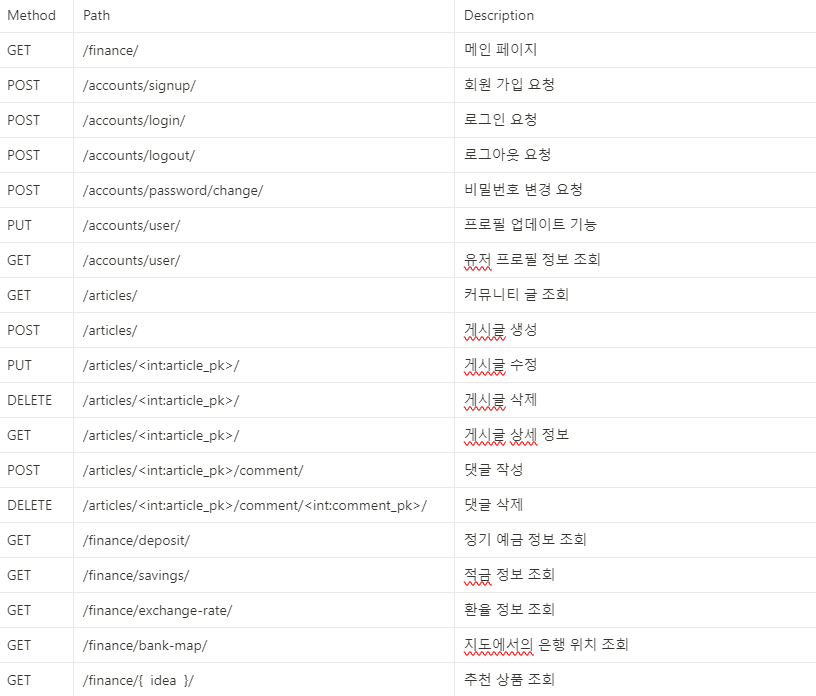
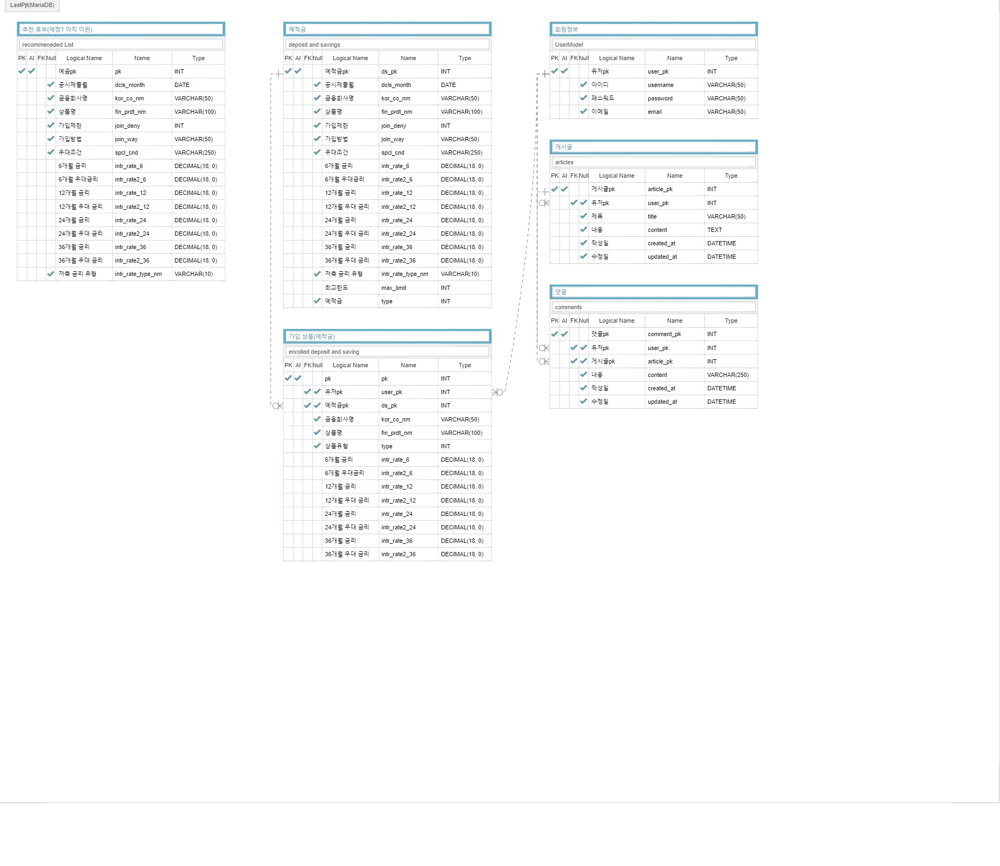
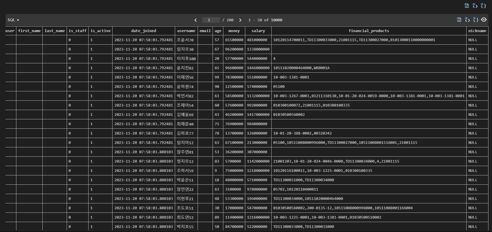

# final-pjt

[전체 일정](https://www.notion.so/eeddf8487cad43109aca775132898fef?pvs=4)
## README 구성
- 팀명
1. 팀원 정보 및 업무 분담 내역 (회의 후 결과) (일정표 - 툴사용 or 액셀 표 사용)
2. 설계 내용(아키텍처 등)및 실제 구현 정도
3. 테이터베이스 모델링(ERD)
4. 금융 상품 추천 알고리즘에 대한 기술적 설명
5. 서비스 대표 기능들에 대한 설명
6. 기타(느낀 점, 후기 등) - 후기 : 어떠한 기능을 더 구현하는 것도 좋겠다 혹은 이런걸 구현하려고 해봤지만 어떠한 것 때문에 못했다.


## 2023.11.16

### 회의 내용
#### 회의 주제
- 기능 : 나에게 맞는 상품 추천
- 사용할 아키텍처 정하기
- 구조 세분화
- 데이터베이스 모델링(ERD), URL설계도 계획 및 작성
- 설계 및 역할 분담 정하기
- 메인 타겟 설정하기


##### 나에게 맞는 상품 추천 (아이디어-브레인스토밍)
1. 기준을 제시하며 추천 방법
    1. 월 얼마를 버시나요? (학생일 경우 용돈) 다음 질문으로 넘어감
    2. 안전 지향형 or 위험 부담형
    3. 유동성 중요한지 or 중요하지 않은지

2. 머신러닝 활용
3. 자신과 성향이 비슷한 사람들이 인기가 많은 상품 추천
4. 혜택 중심으로 고객이 원하는 혜택이 많은 상품 추천
5. 환율 정보를 바탕으로 외화정기예금 추천


## 회의 결과
사용 아키텍처
- Django REST Framework
- Vue3

URL 예상 설계도
- back



ERD 예상 설계도


구조 세분화
- 메인 기능 4가지를 각각의 뷰를 사용하여 nav바를 활용하여 router링크를 사용하여 구현하는 방법으로 진행
- nav바에 1.예적금 금리 비교, 2.환율 계산, 3.커뮤니티, 4.프로필페이지 구현
- 우대금리와 정기예금 금리 따로 볼 수 있도록 구현해보기

### 그라운드 룰
1. 지각하지 않기
2. 상대방의 코드 작성이 늦어 지더라고 재촉하지 말고 서로 도와주기
3. 노션을 활용하여 각자의 오늘 한 일 및 코드 구현 방법 올리기
4. 이슈사항 바로바로 알려주기

----------------------------------------

## 11.17 2일차 회의

### 오늘 목표
백엔드
- accounts앱
- articles앱 완성시키기
- finanace 시도해보기
- 아이디어 더 구체화 해보기

프론트엔드
- stores에 회원가입, 로그인, 로그아웃 기능 구현
- HomeView
- LoginView
- ProfileView


### 결과 회의
#### 오늘 한 일
##### 백엔드
재완
- accounts앱 완성(회원가입 시 email, nickname, age입력)
- articles앱 완성(게시글 작성, 수정, 삭제, 조회, 댓글 작성, 삭제, 게시글에 댓글 개수 조회)

인범
- finance앱 (예적금 정보 조회 및 업데이트 (업데이트 20초 정도 소요 - admin계정 만들어서 업데이트 수동으로 진행 예정))

##### 프론트엔드
준선
- LoginView, SignupView 완성
- ArticleView 제작 중(생성, 댓글 미완)
- stores (로그인 기능, 회원가입, 게시글 조회 완성)
- navbar css 틀 완성 

-----------------------------------------------------

## 11.20 일
# 11.20 회의

### 오늘 할일
백엔드
- 예적금 상세페이지 완성
- 아이디어 구체화

프론트엔드
- 환율 정보 받아오는 vue완성
- 지도 vue 완성
- 게시판 기능 완성
- 유저프로필 완성하기


### 남은 일
- 아이디어 바탕으로 백엔드 완성
- 예적금 vue 완성
- 아이디어 vue완성
- css
- 발표용 PPT만들기
- 메인페이지 만들기
- 유저 프로필에서 가입한 상품 금리정보 코드 구현


### 결과
재완
- 프론트 지도 구현 (실패) - 지도 정보를 받아오긴 하였지만 기능을 추가시킬 경우 지도가 사라지는 현상이 계속 발생 (구글 맵api를 받아 진행하였지만 계속 실패를 하여 카카오 맵api를 받아 다음 날 진행 하기로 결론)
```vue
// 구글 맵 api 가이드 참조하여 만든 코드 (현재 위치에 대하여 지도 검색기능)

<script>
export default {
  data() {
    return {
      map: null,
      infoWindow: null
    };
  },
  mounted() {
    // 비동기로 Google Maps API 스크립트 로드
    const script = document.createElement("script");
    script.src = `https://maps.googleapis.com/maps/api/js?key=YOUR_API_KEY&callback=initMap`;
    script.defer = true;
    script.async = true;
    document.head.appendChild(script);
    window.initMap = this.initMap;
  },
  methods: {
    initMap() {
      this.map = new google.maps.Map(this.$refs.map, {
        center: { lat: -34.397, lng: 150.644 },
        zoom: 6
      });

      this.infoWindow = new google.maps.InfoWindow();

      const locationButton = document.createElement("button");
      locationButton.textContent = "Pan to Current Location";
      locationButton.classList.add("custom-map-control-button");
      this.map.controls[google.maps.ControlPosition.TOP_CENTER].push(locationButton);

      locationButton.addEventListener("click", () => {
        if (navigator.geolocation) {
          navigator.geolocation.getCurrentPosition(
            (position) => {
              const pos = {
                lat: position.coords.latitude,
                lng: position.coords.longitude
              };
              this.infoWindow.setPosition(pos);
              this.infoWindow.setContent("Location found.");
              this.infoWindow.open(this.map);
              this.map.setCenter(pos);
            },
            () => {
              this.handleLocationError(true, this.infoWindow, this.map.getCenter());
            }
          );
        } else {
          this.handleLocationError(false, this.infoWindow, this.map.getCenter());
        }
      });
    },
  }}
</script>


```

- 유저 정보 코드 바탕으로 더미데이터 load시키기

- 아이디어 구체화


인범
- 백엔드 : 예적금 상세정보 페이지 코드 구현 완료
```python
@api_view(['GET'])
def detail(request, detail_pk):
    products = DepositAndSavings.objects.get(pk=detail_pk)
    serializer = DepositAndSavingsSerializer(products)
    return Response(serializer.data)
```
- 프론트엔드 : 환율정보 출력 components 완성
```vue
<script setup>
onMounted(() => {
  axios({
    url: `http://127.0.0.1:8000/finance/exchange-rate/`
  })
    .then((res) => {
      exchange.value = res.data
    })
})


const wonChange = function (event) {
  won.value = event.target.value
  console.log(won.value, exchange.value[selected.value])
  foreign.value = won.value / exchange.value[selected.value]
  foreign.value = foreign.value.toFixed(2)
}

const foreignChange = function (event) {
  foreign.value = event.target.value
  console.log(won.value, foreign.value)
  won.value = foreign.value * exchange.value[selected.value]
  won.value = won.value.toFixed(2)
}
</script>
```
- 아이디어 구체화

준선
- 프론트엔드 : 게시판 기능 (댓글 생성, 게시글 화면에서 댓글 갯수 출력, 댓글 삭제 기능 구현)
```vue
<scirpt setup>

const createComment = () => {
  axios({
    method: 'post',
    url: `${API_URL}/articles/${route.params.article_pk}/comment/`,
    data: {
      content: content.value,
    },
    headers: {
      Authorization: `Token ${token.value}`
    }
  })
    .then((res) => {
      console.log(res.data)
      return axios({
        method: 'get',
        url: `${API_URL}/articles/${route.params.article_pk}/`,
      })
      .then((res) => {
        router.go();
        })
    })
}

const deleteComment = (comment_pk) => {
  console.log(comment_pk)
  axios({
    method: 'delete',
    url: `${API_URL}/articles/comment/${comment_pk}/`,
    headers: {
      Authorization: `Token ${token.value}`
    },
  })
    .then(() => {
      // 댓글 삭제 후, 해당 글의 정보를 다시 가져와서 댓글 목록을 업데이트
      return axios({
        method: 'get',
        url: `${API_URL}/articles/${route.params.article_pk}/`,
      });
    })
    .then((res) => {
      article.value = res.data;
    })
    .catch((err) => {
      console.error(err);
    });
}
</script>
```


## 결론
오늘 예상 일정보다 많이 부족한 결과가 나오게 되었다. 
#### 아이디어 
- 더미데이터를 생성하여 여러 조건에 비슷한 데이터를 비교하여 자신과 비슷한 조건을 가진 사람들이 가입한 상품목록을 추천하는 상품

미완성 일정
- 지도 vue 완성
- 유저 프로필 vue 완성